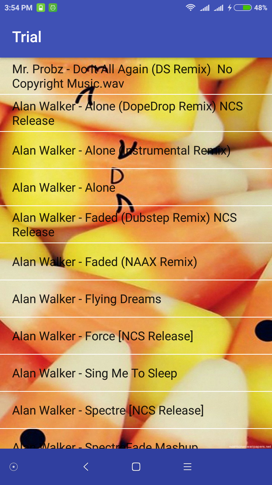

# Simple-Music-Player
Dont Forget to add Storage Permissions manually or else the app will crash or wont display songs
this is a very simple music player which displays all the songs on the device into a listview and when you click on a song 
it takes you to the main player activity where it plays the song with three basic functions to go to next song,to go to a previous
song and play/pause song.

